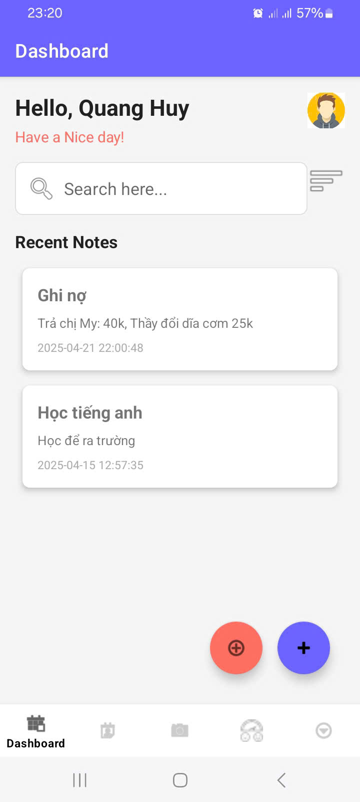
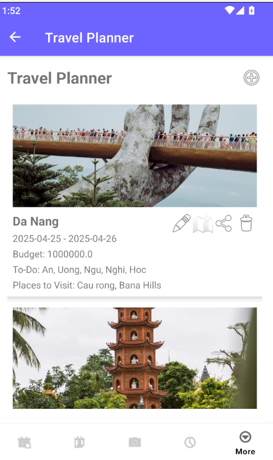
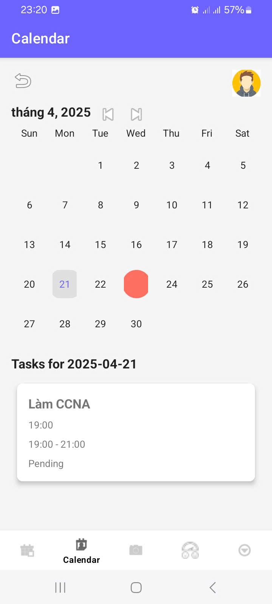
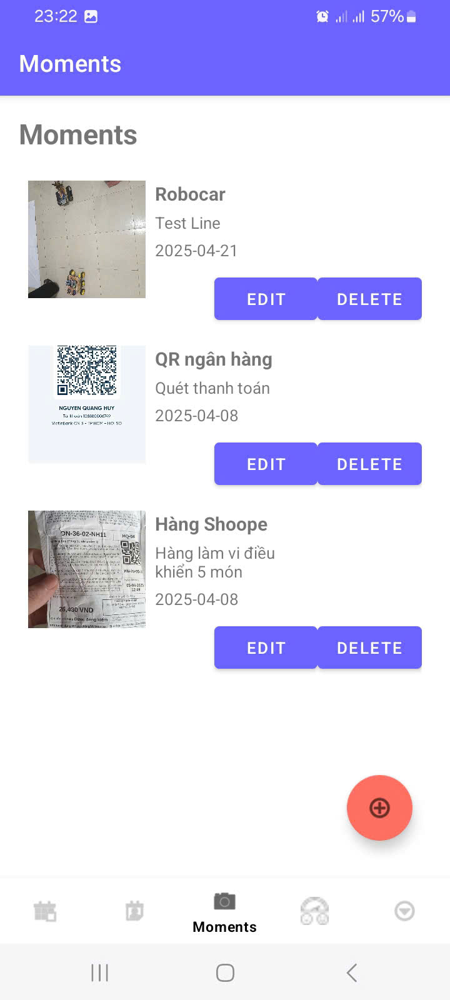
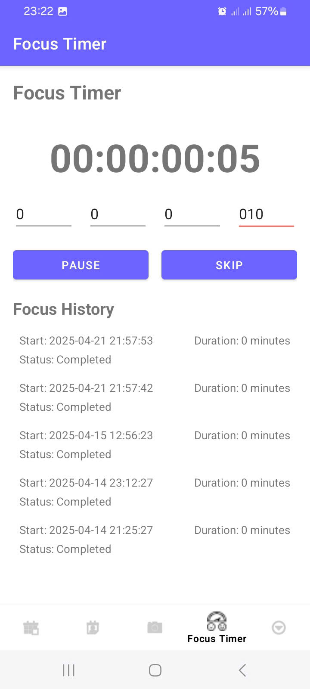
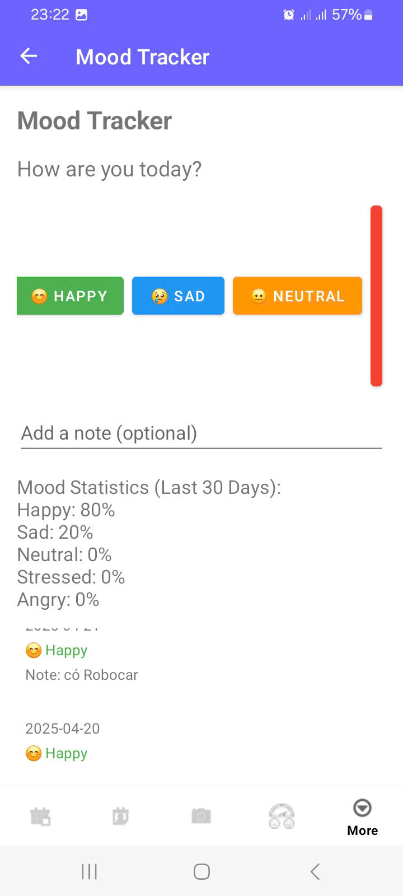

# To-Do App with Travel Planner


**To-Do App with Travel Planner** is a comprehensive Android application designed to streamline task management and travel planning. This app integrates real-time weather data via the Open-Meteo API, stunning destination images from the Unsplash API, and persistent local storage with Room Database. Built with modern Android development practices, it supports both USB and Wireless Debugging for testing on physical devices.

## Table of Contents
- [Project Overview](#project-overview)
- [Features](#features)
- [Screenshots](#screenshots)
- [Requirements](#requirements)
- [Installation](#installation)
- [Usage Guide](#usage-guide)
- [Project Architecture](#project-architecture)
- [Dependencies](#dependencies)
- [Development Setup](#development-setup)
- [Testing](#testing)
- [Known Issues](#known-issues)
- [Contributing Guidelines](#contributing-guidelines)
- [License](#license)
- [Acknowledgments](#acknowledgments)
- [Contact Information](#contact-information)

## Project Overview
This project was developed as a personal learning exercise and a practical tool for managing daily tasks and travel plans. It leverages Kotlin, Jetpack libraries, and third-party APIs to provide a seamless user experience. The app is compatible with Android 7.0 (API 24) and above, with optimizations for the latest Android 15 (API 35).

## Features
- **Task Management**: Create, edit, and delete tasks with a clean, intuitive UI.
- **Travel Planning**: Add detailed travel plans including destination, dates, budget, to-do lists, and places to visit.
- **Weather Integration**: Display real-time weather forecasts based on location and date using Open-Meteo API.
- **Image Loading**: Fetch and display high-quality images for destinations via Unsplash API.
- **Work Location Support**: Differentiate between travel and work locations with tailored UI adjustments.
- **Offline Functionality**: Store all data locally using Room Database.
- **Cross-Device Compatibility**: Supports physical devices via USB Debugging or Wireless Debugging (Android 11+).

## Screenshots
Explore the app's interface and functionality through these detailed screenshots, showcasing key features and screens:

| **Home Screen** - Displays the list of plans with action buttons. | **Travel Planner Screen** - Form to input travel details. |
|------------------------------------------|-------------------------------|
|  |  |

| **Calendar Screen** - Calendar view for planning. | **Moments Screen** - Highlights special moments or notes. |
|---------------------------------------|---------------------------------|
|  |  |

| **Focus Timer Screen** - Timer for focused tasks. | **Mood Tracker Screen** - Mood tracking interface. |
|---------------------------------------|----------------------------------|
|  |  |

*Note*: The `screenshots` folder is located in the root directory of the repository. Ensure all image files (`calendar_screen.jpg`, `focus_timer_screen.jpg`, `home_screen.jpg`, `moments_screen.jpg`, `mood_tracker_screen.jpg`, `travel_planner_screen.png`) are uploaded to this folder.

## Requirements
### Development Environment
- **IDE**: Android Studio (latest stable version, e.g., Hedgehog 2023.1.1 or higher)
- **SDK**: Android SDK with API 35 (Android 15) installed
- **Build Tools**: Gradle 8.5 or higher
- **Java**: JDK 11 (embedded in Android Studio or manually installed)

### Hardware
- **Android Device**: Minimum API 24 (Android 7.0 Nougat), recommended API 35 (Android 15)
- **Operating System**: Windows 11 (tested), macOS, or Linux
- **Connectivity**: USB cable for USB Debugging or same Wi-Fi network for Wireless Debugging

### Dependencies
See [Dependencies](#dependencies) section for a complete list.

## Installation
Follow these steps to set up and run the project on your local machine:

1. **Clone the Repository**:
   ```bash
   git clone https://github.com/username/to-do-app.git
   cd to-do-app
